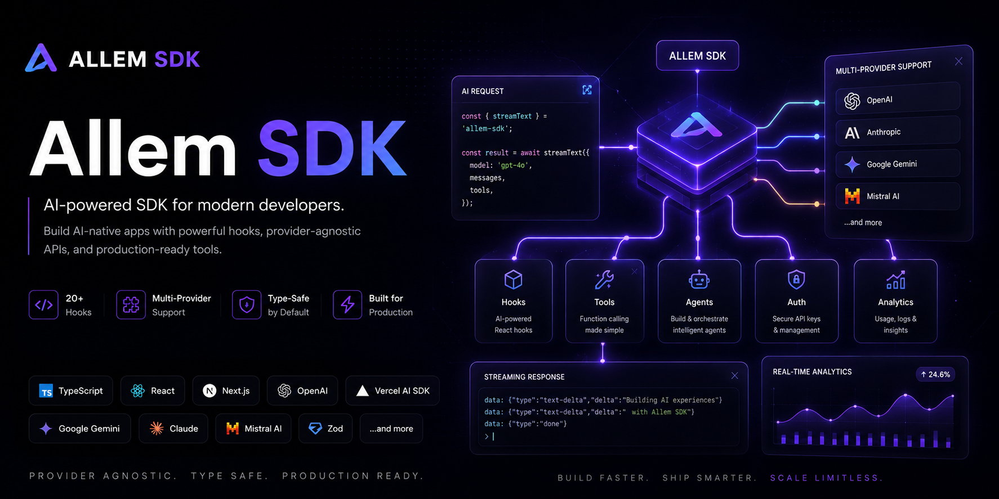

<p align="center">
  
</p>

<p align="center">
  <a href="https://www.npmjs.com/package/allem-sdk"></a>
  <a href="./LICENSE"></a>
  
  
  
  
</p>

The React SDK for modern apps. Hooks, AI, forms, analytics, and auth in one toolkit.

## Packages

| Package | Description | npm | Docs |
|---------|-------------|-----|------|
| `allem-sdk` | Meta-package that installs everything | [](https://www.npmjs.com/package/allem-sdk) | [README](./packages/allem-sdk) |
| `@allem-sdk/hooks` | Essential React hooks (useDebounce, useLocalStorage, useMediaQuery, ...) | [](https://www.npmjs.com/package/@allem-sdk/hooks) | [README](./packages/hooks) |
| `@allem-sdk/ai` | AI hooks built on Vercel AI SDK v6 (multi-provider chat, completions) | [](https://www.npmjs.com/package/@allem-sdk/ai) | [README](./packages/ai) |
| `@allem-sdk/agents` | Agentic AI with tool calling, status tracking, and typed tool definitions | [](https://www.npmjs.com/package/@allem-sdk/agents) | [README](./packages/agents) |
| `@allem-sdk/forms` | Lightweight form management and validation | [](https://www.npmjs.com/package/@allem-sdk/forms) | [README](./packages/forms) |
| `@allem-sdk/analytics` | Provider-agnostic analytics hooks | [](https://www.npmjs.com/package/@allem-sdk/analytics) | [README](./packages/analytics) |
| `@allem-sdk/auth` | Authentication helpers (session, protected routes) | [](https://www.npmjs.com/package/@allem-sdk/auth) | [README](./packages/auth) |

## Build with AI Agents

Allem SDK ships with a skill that teaches AI coding agents the full API, including hooks, patterns, and best practices. Install it once and let Claude Code, Cursor, Codex, or any skills-compatible agent build with Allem SDK for you.

```bash
npx skills add kingofmit/allem-sdk
```

The agent gets complete coverage of all 5 packages, so it knows how to wire up providers, compose hooks, validate forms, and set up auth without you having to explain the API.

## Quick Start

### Hooks

```tsx
import { useDebounce, useLocalStorage, useMediaQuery } from "@allem-sdk/hooks";

function Search() {
  const [query, setQuery] = useLocalStorage("search", "");
  const debouncedQuery = useDebounce(query, 300);
  const isMobile = useMediaQuery("(max-width: 768px)");

  return <input value={query} onChange={(e) => setQuery(e.target.value)} />;
}
```

### AI Chat

```tsx
import { useState } from "react";
import { useAllemChat } from "@allem-sdk/ai";

function Chat() {
  const [input, setInput] = useState("");
  const { messages, sendMessage, status } = useAllemChat();

  return (
    <div>
      {messages.map((m) => (
        <div key={m.id}>
          {m.parts?.filter((p) => p.type === "text").map((p) => p.text).join("")}
        </div>
      ))}
      <form onSubmit={async (e) => {
        e.preventDefault();
        const text = input;
        setInput("");
        await sendMessage({ text });
      }}>
        <input value={input} onChange={(e) => setInput(e.target.value)} />
        <button type="submit">Send</button>
      </form>
    </div>
  );
}
```

### Forms

```tsx
import { useForm, required, email } from "@allem-sdk/forms";

function ContactForm() {
  const form = useForm({
    name: { initialValue: "", rules: [required()] },
    email: { initialValue: "", rules: [required(), email()] },
  });

  return (
    <form onSubmit={form.handleSubmit((values) => console.log(values))}>
      <input {...form.getFieldProps("name")} />
      <input {...form.getFieldProps("email")} />
      <button type="submit">Send</button>
    </form>
  );
}
```

### Analytics

```tsx
import { AnalyticsProvider, useTrack } from "@allem-sdk/analytics";

const mixpanelAdapter = {
  track: (event, props) => mixpanel.track(event, props),
  page: (name, props) => mixpanel.track_pageview({ page: name, ...props }),
  identify: (userId, traits) => mixpanel.identify(userId),
};

function App() {
  return (
    <AnalyticsProvider adapters={[mixpanelAdapter]}>
      <MyApp />
    </AnalyticsProvider>
  );
}
```

### Auth

```tsx
import { AuthProvider, useAuth, ProtectedRoute } from "@allem-sdk/auth";

function Dashboard() {
  const { user, signOut } = useAuth();
  return <button onClick={signOut}>Sign out, {user?.name}</button>;
}

function App() {
  return (
    <AuthProvider adapter={myAuthAdapter}>
      <ProtectedRoute fallback={<LoginPage />}>
        <Dashboard />
      </ProtectedRoute>
    </AuthProvider>
  );
}
```

## Example App

The [`apps/examples/nextjs`](./apps/examples/nextjs) directory contains a full Next.js 16 app demonstrating all 5 packages working together: interactive hook demos, AI chat, form validation, auth flow with protected routes, and a multi-widget dashboard.

```bash
pnpm example:dev
```

## Tech Stack

- [React 19](https://react.dev/) with `"use client"` directives
- [Vercel AI SDK v6](https://sdk.vercel.ai/) for `@allem-sdk/ai`
- [TypeScript](https://www.typescriptlang.org/) (strict mode)
- [Turborepo](https://turbo.build/) + [pnpm](https://pnpm.io/) workspaces
- [tsup](https://tsup.egoist.dev/) (ESM + CJS builds)
- [Vitest](https://vitest.dev/) (44 tests)
- [Changesets](https://github.com/changesets/changesets) for versioning

## Development

```bash
git clone https://github.com/kingofmit/allem-sdk.git
cd allem-sdk
pnpm install
pnpm build
pnpm test
```

See [CONTRIBUTING.md](./CONTRIBUTING.md) for more details.

## Support

If you find Allem SDK useful, consider supporting its development:

<a href="https://buymeacoffee.com/kingofmit" target="_blank"></a>

## License

[MIT](./LICENSE) - [Ahmed Allem](https://kingallem.com)
